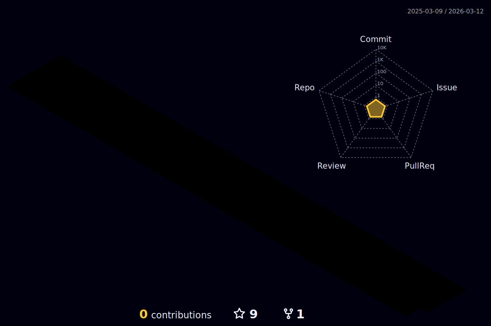

  
  <!-- dynamic typing effect 动态打字效果 -->
  

    
  

  

  <!-- knock code pictures 敲代码的图片 -->
  
  

   
  

  <!-- profile logo 个人资料徽标 -->
  

    &emsp;
    &emsp;
    &emsp;
    <!-- visitor statistics logo 访客数统计徽标 -->
    
  

  <!-- Snake Code Contribution Map 贪吃蛇代码贡献图 -->
  

#  🙋 Hello

<table>
<tr><td>

<!-- About me 关于我 -->
###   About Me

&emsp;&emsp;大家好，我是一名运维工程师。

&emsp;&emsp;在运维方面，我具有优秀的系统架构设计能力，能够实施高可用、高效率的云运维环境。

&emsp;&emsp;另外，我还具备丰富的云平台使用经验，包括 AWS、阿里云、腾讯云等

&emsp;&emsp;长风破浪会有时，直挂云帆济沧海。我开始得太晚了，但总不算太迟。春华秋实，努力一定会有收获，一枚学渣正在悄悄蜕变...

</td></tr>
<tr>
<td>

<!--  skill badge 技能徽章 -->

🧰 常用的工具

           

<!-- programming tool icon 编程工具图标 -->
 

<!-- profile-3d-contrib 3D贡献图-->

